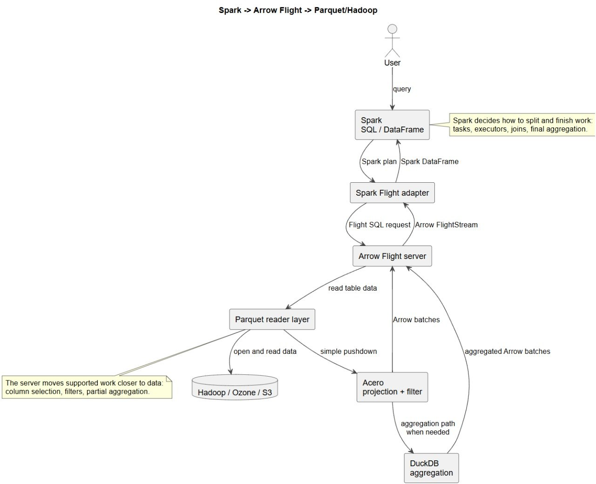

# Hadoop Arrow Flight SQL Server Overview

Provides high-performance Parquet access via **Arrow Flight SQL**. Enables analytical queries with distributed processing, data locality, and optimizations (fast-path, C++ filtering, DuckDB for aggregations). Runs in cluster mode coordinated by Hazelcast.

---
## Helper Scripts

Located in `src/main/shell/`:
- **`start_server.sh`**: Launches the Flight SQL server.
- **`start_generator.sh`**: Generates test Parquet datasets.
- **`spark_submit_client.sh`**: Submits the Spark client to query the server.
- **`generate_data.log`**: Log output from the data generation process.

## Server Parameters

When launching the server (via `start_server.sh` or `java -jar`), use the following arguments:

| Parameter | Description | Example |
| :--- | :--- | :--- |
| `--data-dir` | Directory containing Parquet files. | `/mnt/data/parquet` |
| `--port` | Flight SQL server port. | `32010` |
| `--hosts` | Comma-separated list of Hazelcast cluster node IPs. | `192.168.1.10,192.168.1.11` |
| `--localhost` | Local IP address to bind the server to. | `192.168.1.10` |
| `--hazelcast-port` | Port for Hazelcast cluster communication. | `5701` |

*(Note: The server blocks startup until all nodes specified in `--hosts` join the Hazelcast cluster).*

---
## Tech Stack

| Technology                | Role                                                          |
| ------------------------- | ------------------------------------------------------------- |
| **Arrow Flight SQL**      | Transport protocol and client API                             |
| **jOOQ**                  | SQL parsing (query structure extraction)                      |
| **Hazelcast**             | Distributed cache, node registry, locks                       |
| **Hadoop FileSystem**     | HDFS / S3 / local FS access                                   |
| **Parquet**               | On-disk storage format                                        |
| **Acero (Arrow Dataset)** | Parquet scanning, filtering, projection (C++)                 |
| **DuckDB**                | Aggregation execution (GROUP BY, SUM, COUNT) on file groups   |
| **Substrait / Isthmus**   | SQL filter to Acero plan conversion                           |

---
## Architecture

---

## Component Details

- **Flight SQL Server Adapter**: Handles Arrow Flight requests (`GetFlightInfo`, `DoGet`). Parses SQL via `ParquetQueryParser`, distributes files across nodes (via Hazelcast), and generates client `Ticket`s.
- **Query Parser**: Uses jOOQ to extract schema, table, columns, WHERE, aggregations, and GROUP BY.
- **Coordinator (Hazelcast)**: Provides distributed query context cache (`statementCache`), node registry (`serverRegistry`), and locks for atomic file acquisition.
- **Parquet Execution Adapter**: Core execution engine. Dispatches queries:
  - *Non-aggregations*: Scans via Acero with Substrait filter (if WHERE exists).
  - *Aggregations*: Uses fast-path (footer read) or passes file groups to DuckDB via Acero (Arrow C Stream).
- **Acero**: C++ Arrow Dataset engine for projection, filtering, and partial aggregations (data source for DuckDB).
- **DuckDB**: Executes full aggregations (`GROUP BY`, `SUM`, `COUNT`, etc.) over file groups via Arrow C Stream.
- **Hadoop FS**: Abstraction for Parquet file access (HDFS, S3, local FS).

---

## Execution Flow

1. **Client** sends SQL via `GetFlightInfo`.
2. **Flight Adapter** parses the query, extracts the schema, saves it to Hazelcast, and calls `determineEndpoints` to distribute files considering locality.
3. Returns `FlightInfo` with endpoints (each containing a `Ticket` and node address).
4. **Client** calls `DoGet` for each endpoint (passing the Ticket).
5. On each node, **Flight Adapter** restores the query and file list from the Ticket, initiating a two-phase file acquisition via Hazelcast locks.
6. **Parquet Adapter** executes via Acero or DuckDB (with fast-path if applicable) and streams results as `VectorSchemaRoot`.
7. **Client** receives and processes data.

---

## Supported Features

- `SELECT` with projection, filtering (`WHERE`), aggregations (`COUNT`, `SUM`, `MIN`, `MAX`, `GROUP BY`).
- Info commands (schemas, tables, types, server properties).
- Distributed processing, data locality, parallelism.
- Optimizations: fast-path (footer read), C++ filtering (Substrait), DuckDB for aggregations.

## Limitations

- `SELECT` only (read-only).
- Single table in `FROM` (no JOINs).
- No `ORDER BY`, `LIMIT`, subqueries, or window functions.
- `GROUP BY` aggregations require client-side partial result merging.
